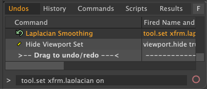

# Laplacian Smoothing tool for Modo plug-in
This a Modo Plug-in kit to smooth mesh vertex positions using Laplacian algorithm based on a curvature flow Laplace Beltrami operator in a diffusion equation. This allows you to reduce noise on a mesh’s surface with minimal changes to its shape.

This kit contains direct modeling tool plugins for Modo macOS and Windows.


<div align="left">

</div>


## Installing
- Download lpk from releases. Drag and drop into your Modo viewport. If you're upgrading, delete previous version.

## How to use Laplacian tool
The laplacian smoothing tool is named **xfrm.laplacian**. Type **tool.set xfrm.laplacian on** on command field of command history viewport.
After setup the laplacian smoothing tool, you can see **Iterations** attribute on the tool property viewport.
<div align="left">

</div>

## Building codes

- LXSDK
This kit requires Modo SDK (Modo 16.1v8 or later). Download and build LXSDK and set you LXSDK path to LXSDK_PATH in CMakeLists.txt in triagulate.
- Igl library.
This also requires Igl library. Download and build Igl from below and set the include and library path to CMakeLists.txt.

## License

```
This software is based part on libigl : A simple c++ geometry processing library:
Copyright 2013 - Alec Jacobson, Daniele Panozzo, Olga Diamanti, Kenshi
Takayama, Leo Sacht, Interactive Geometry Lab - ETH Zurich
https://libigl.github.io
Licensed under the MPL-2.0 license.
```
