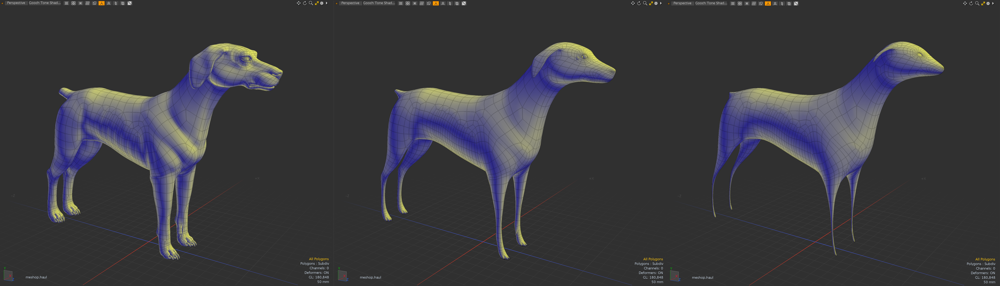

# Laplacian Smoothing tools for Modo plug-in
This is a Modo Plug-in kit to smooth mesh vertex positions using Laplacian algorithm based on a curvature flow Laplace Beltrami operator in a diffusion equation. This allows you to reduce noise on a mesh’s surface with minimal changes to its shape.

This kit contains a direct modeling tool and a procedural mesh operator for Modo macOS and Windows.


<div align="left">

</div>

strength: 0.0, 1.0, 2.0 from left to right


## Installing
- Download lpk from releases. Drag and drop into your Modo viewport. If you're upgrading, delete previous version.

## How to use Laplacian tool
The laplacian smoothing tool is named **xfrm.laplacian**. Type **tool.set xfrm.laplacian on** on command field of command history viewport. After setup the laplacian smoothing tool, you can see **Strength** attribute on the tool property viewport.
This supports falloff weights.
<div align="left">

</div>

The procedural mesh operator as **Laplacian Smoothing** is under Deform tab on Mesh Operator viewport. 
<div align="left">

</div>

## Dependencies

- LXSDK  
This kit requires Modo SDK (Modo 16.1v5 or later). Download LXSDK and set you LXSDK path to -DLXSDK_PATH argment in triagulate.
- libigl 2.5.0 (https://github.com/libigl/libigl)  
This also requires Igl library. Download libigl and set the include path to -DLIBIGL_PATH argument. libigl is header only library.
- Eigen 3.4.0 (https://gitlab.com/libeigen/eigen)  
This also requires Eigen library. Download eigen and set the include path to -DEIGEN_PATH argument. Eigen is header only library

If they are not set, the project files are downloaded automatically via FetchContent of cmake

## License

```
This software is based part on libigl : A simple c++ geometry processing library:
Copyright 2013 - Alec Jacobson, Daniele Panozzo, Olga Diamanti, Kenshi
Takayama, Leo Sacht, Interactive Geometry Lab - ETH Zurich
https://libigl.github.io
Licensed under the MPL-2.0 license.
```
